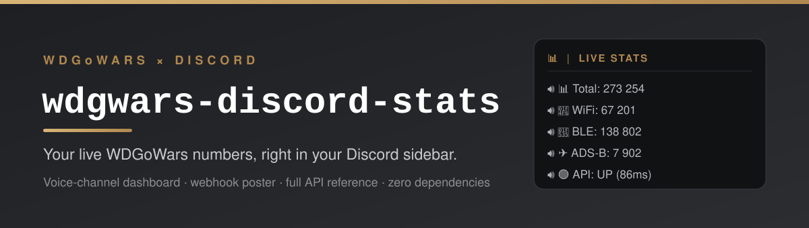

<p align="center">
  
</p>

<p align="center">
  <a href="https://github.com/Yggdrasil-AI-labs/wdgwars-discord-stats/actions/workflows/ci.yml"></a>
  <a href="https://sonarcloud.io/dashboard?id=Yggdrasil-AI-labs_wdgwars-discord-stats"></a>
  <a href="https://github.com/Yggdrasil-AI-labs/wdgwars-discord-stats/releases/latest"></a>
  <a href="#requirements"></a>
  <a href="LICENSE"></a>
  <a href="SECURITY.md"></a>
</p>

# wdgwars-discord-stats

Build your own [WDGoWars](https://wdgwars.pl) stats display in Discord: a live
voice-channel dashboard, a one-shot webhook poster, and a consolidated API
reference so you can build something bigger. Standard-library Python, no
dependencies to install.

## Family

Part of the WDGoWars feeder and tooling family:

- [Muninn](https://github.com/Yggdrasil-AI-labs/adsb-to-wdgwars) - ADS-B feeder
- [Heimdall](https://github.com/Yggdrasil-AI-labs/meshcore-to-wdgwars) - MeshCore LoRa feeder
- [wigle-to-wdgwars](https://github.com/Yggdrasil-AI-labs/wigle-to-wdgwars) - WiGLE Wi-Fi/BLE feeder
- [gungnir](https://github.com/Yggdrasil-AI-labs/gungnir) - shared HMAC upload transport library

## What's here

1. **Live voice-channel display** (`live_stats_channels.py`): a category of
   channels whose names show your current numbers, updated on a schedule, the
   sidebar dashboard look. Needs a Discord bot. You pick which fields to show.
2. **Webhook post** (`discord_stats_webhook.py`): posts a stats embed to a
   channel via an incoming webhook. No bot, just a webhook URL. Simplest.
3. A [consolidated WDGoWars API reference](docs/api-reference.md) so you can
   build something bigger.

**New here?** [GETTING-STARTED.md](GETTING-STARTED.md) is a full zero-to-running
walkthrough, and [FAQ.md](FAQ.md) covers common situations (reusing an existing
bot, Windows, no server, gang stats, and more). The short version is below.

## Option A: live voice-channel display

The sidebar dashboard. A bot renames voice channels in a "live stats" category
so their names read `📊 Total: 273 239`, `📶 WiFi: 67 201`, and so on. You choose
which fields appear, and can toggle them from a mod channel. `setup` builds the
category, the mod channel, and the control panel for you, no manual channel
creation.

### Step 1: make a Discord bot

Only a human can do this part; everything after is one command.

1. Open the [Discord Developer Portal](https://discord.com/developers/applications) and click **New Application**. Name it anything.
2. Left sidebar → **Bot** → **Reset Token** → **Copy**. That is your `DISCORD_BOT_TOKEN`.
3. Invite the bot to your server. Paste this URL in your browser, replacing
   `YOUR_CLIENT_ID` with the **Application ID** from the **General Information**
   page (`permissions=16` is "Manage Channels", the only permission it needs):

   ```
   https://discord.com/oauth2/authorize?client_id=YOUR_CLIENT_ID&scope=bot&permissions=16
   ```
   Pick your server and authorize.
4. Get your server id: Discord → Settings → Advanced → turn on **Developer Mode**,
   then right-click your server icon → **Copy Server ID**.

### Step 2: configure

**Easiest: let it prompt you.** With nothing configured yet, running `--setup`
(next step) asks for your key, bot token, and server id (secrets are typed
hidden), writes a local `.env` for you, and continues. No file editing.

**Or fill it in yourself:**
```sh
cp .env.example .env
# then edit .env: WDGWARS_API_KEY, DISCORD_BOT_TOKEN, DISCORD_GUILD_ID
```
`.env` is gitignored, so your secrets stay local. (You can also `export` the
three variables instead of using a file.)

### Step 3: check + build

```sh
python live_stats_channels.py --check   # validate token / server / permissions / key, no changes
python live_stats_channels.py --setup   # create category + #stats-config + panel, then populate
```

`--check` tells you exactly what is wrong if something is off (bad token, bot not
invited, missing Manage Channels, bad key) with the fix for each. `--setup`
creates the `📊 │ live stats` category, a `#stats-config` mod channel with a
pinned control panel, and (if your key is set) populates the stat channels. Both
are safe to re-run.

The `#stats-config` channel is created **private** by default (hidden from
regular members; server admins still see it, and you toggle from it). Set
`STATS_CONFIG_PRIVATE=off` if you want it visible to everyone. Deleting it
entirely is fine too, the display keeps working and you configure via the config
file or `STATS_FIELDS_OFF`.

### Step 4: keep it updating

**This is meant to run locally.** It's a small, self-hosted Python script: your
API key and bot token stay on your own machine and you keep control of it.

**Easiest: let it install itself.** One command sets up a quiet,
boot-persistent background runner for your platform:

```sh
python live_stats_channels.py --schedule
```

- **Windows:** creates a Scheduled Task that runs every 5 minutes with
  `pythonw.exe`, so **no console window pops up** and there is no log spam. It
  runs while you are logged in.
- **Linux / Raspberry Pi:** installs a `systemd --user` service, enables
  lingering (so it starts at boot and keeps running after you log out of SSH),
  and starts it. Follow it with `journalctl --user -u wdgwars-live-stats -f`.
- **Anything else:** prints a `cron` line for you to add with `crontab -e`.

Undo it any time with `python live_stats_channels.py --unschedule`. The interval
comes from `STATS_INTERVAL` (seconds, default 300), so set that before
`--schedule` if you want a different cadence.

**Prefer to wire it up yourself?** Any of these work too:

```sh
python live_stats_channels.py            # run in the foreground (5-min loop)
python live_stats_channels.py --once     # one update; point your own cron / Task Scheduler at it
```

For systemd by hand: copy `.env.example` to
`~/.config/wdgwars-discord-stats/env` (fill in, `chmod 600`), copy
`systemd/wdgwars-live-stats.service` to `~/.config/systemd/user/`, run
`loginctl enable-linger $USER`, then
`systemctl --user enable --now wdgwars-live-stats.service`. (`--schedule` does
all of that for you.)

**GitHub Actions is an option, not the default.** If you genuinely have no
machine to leave running, fork this repo, add `WDGWARS_API_KEY`,
`DISCORD_BOT_TOKEN`, and `DISCORD_GUILD_ID` under **Settings → Secrets and
variables → Actions**, and the included
[`.github/workflows/live-stats.yml`](.github/workflows/live-stats.yml) updates
the display every ~10 minutes on GitHub's runners (run `--setup` once locally
first). Trade-off to be aware of: this puts your key and token in GitHub's
secret store, they leave your machine. If keeping credentials local matters to
you, use one of the local options above.

### Choosing what to show

Not everyone wants every number public. Easiest first:

- **React on the panel:** the pinned panel in `#stats-config` has one emoji per
  field. Click a field's emoji to toggle it on/off. The poller applies it, clears
  your reaction (so it acts like a button), updates the panel, and adds/removes
  the matching channel. (Takes up to one tick, ~5 min, to reflect.)
- **Config file:** edit `~/.wdgwars-live-stats.json`, e.g. `{"fields": {"BLE": false}}`
  (a field missing from the map is shown).
- **Environment** (works even where the config file does not persist, e.g.
  GitHub Actions): set `STATS_FIELDS_OFF=BLE,Rank`.

## Option B: webhook post

1. Get your API key from your profile at `wdgwars.pl/profile`.
2. In your Discord server: Server Settings, then Integrations, then Webhooks.
   Create a webhook pointed at the channel you want, then copy its URL.
3. Export both (do not hard-code them):

   ```sh
   export WDGWARS_API_KEY="your-64-char-key"
   export DISCORD_WEBHOOK_URL="https://discord.com/api/webhooks/..."
   ```

4. Run it:

   ```sh
   python discord_stats_webhook.py --sample    # posts canned stats, no API key needed
   python discord_stats_webhook.py --dry-run   # prints the payload, posts nothing
   python discord_stats_webhook.py             # posts your real stats to Discord
   ```

   Run `--sample` first to confirm your webhook works and the embed looks right,
   then drop it to post your real numbers.

That is the whole thing. Put it on a cron if you want a daily stats post.

## Requirements

Python 3.8 or newer. Standard library only, nothing to install.

## Key safety

Your API key is a bearer credential for your account. The script reads it from
the environment, never prints it, and redacts it from any error output. Never
commit it, never paste it into a channel. The webhook URL is also a secret:
anyone who has it can post to that channel.

## Where the numbers come from

The script reads [`GET /api/me`](docs/api-reference.md#3-read-endpoints), which
returns your username, per-type capture counts (Wi-Fi, BLE, aircraft, MeshCore),
and lifetime total. See the [API reference](docs/api-reference.md) for the full
field list, what the API does not expose, and the other read endpoints you can
build on.

## A note on scope

This is a community tool, not official LOCOSP software. The API reference is
compiled from operating the public feeders and from LOCOSP's answers in the
WDGoWars Discord. If the live API disagrees with the docs, open an issue.

Maintained by Hiro AlleyCat ([github.com/HiroAlleyCat](https://github.com/HiroAlleyCat)).

## License

MIT. See [LICENSE](LICENSE).
